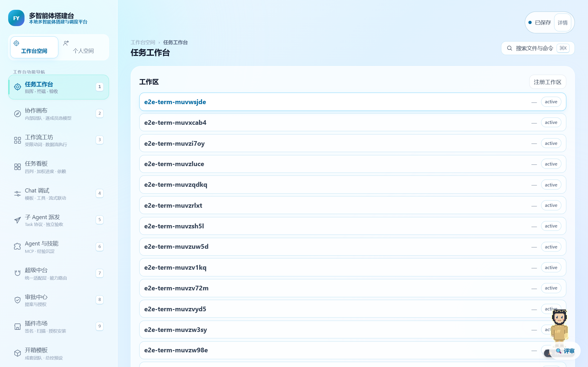

<p align="center">
  
</p>

# FY Orbit · 星轨 (Find Yourself)

<p align="center">
  <strong>企业级全能智能体调度中枢 · 自适应工作流工坊 · 100% 本地优先与绝对掌控力体系</strong><br>
  <em>Enterprise Multi-Agent Orchestration & Workflow Studio | Local-First, Zero-Runaway, Full Human Control</em>
</p>

<p align="center">
  <a href="https://github.com/intp41455/FY-Orbit/releases/download/v1.0.0/FY-Orbit-Windows-v1.0.0.zip">
    
  </a>
  
  
  
  
  
  
  
  
</p>

---

## 🌟 核心定位：终结多智能体落地痛点与失控焦虑

当前市面上的 AI 工作流与智能体框架层出不穷，但每一个产品都不可避免地存在严重的场景缺陷与用户痛点：
* **Dify / Coze (扣子)**：强绑定公网云端 SaaS 或高门槛容器集群，必须上传企业和个人私有数据，存在不可忽视的数据泄露风险与合规壁垒；断网即瘫痪，无法在物理隔离或内网环境中运作。
* **Langflow / Flowise**：止步于单向拖拽连线，缺乏真正的代码级工程能力与深度开发工具链，复杂逻辑难以编写与调试，缺少工业级协同。
* **AutoGen / CrewAI**：仅为纯 Python 代码库或终端 CLI，缺乏开箱即用的可视化界面、任务状态看板与持久化基座，报错即崩溃，开发门槛极高。
* **业界最大的痛点与恐惧 ——「AI 智能体失控焦虑」**：大多数工具一旦点击运行，AI 自动改写代码、调用工具、修改系统，极易产生幻觉偏离轨道，引发误删数据、配置错乱或资费超支等无法挽回的破坏性局面。

<p align="center">
  
</p>

---

### 🛡️ FY Orbit 的破局之道：全能工坊 + 绝对掌控力 (Zero-Runaway Architecture)

**FY Orbit · 星轨** 将工业级严谨标准、严格质量保障、无限日志追溯与安全备份回滚机制融入多智能体调度体系：

1. **绝对的人机协同掌控感（人永远是最高裁决者）**：
   * **人在回路审批中枢 (HITL - Human-in-the-Loop)**：高危写操作、敏感外部 API 调用与环境变更在执行前强制触发挂起审批，无人类授权绝不越雷池一步。
   * **时间机器存档分叉与秒级回滚 (`ArchiveForks` & `Snapshots`)**：任何高危操作前置自动落盘物理快照。无论 AI 尝试了多么复杂的变更，用户随时可一键分叉、精准回滚到任意历史时间节点，彻底杜绝无法挽回的损失。
   * **三层质量把关与独立第三方质检 Agent (`Claw Quality Gates`)**：内置「智能体自审」、「交叉互检」以及「物理隔离的独立第三方质检裁判 Agent」，未通过工业级断言验证的产物一律就地拦截打回。
   * **不可逆 SHA-256 审计哈希链与无限追溯**：每一次状态迁移、工具调度、鉴权裁决均记入抗篡改的审计链，全链路 OpenTelemetry Trace 深度追踪，执行过程 100% 透明可查。
   * **一键物理熔断与瞬时降级**：配备最高优先级的安全开关，遇突发异常即刻切断下游调用，保护核心资产。

2. **全角色包容：零基础小白与顶尖架构师的无缝桥梁**：
   * **🌱 零基础小白 / 业务专家**：无需写代码，自然语言对话一句话直译工作流（Zero-Code Synthesis），向导式问答拆解复杂目标，开箱即用。
   * **🛠️ 全栈工程师 / 极客架构师**：配备高密度 Monaco IDE 工作台、DSL/AST 语法树实时双向热同步、LSP 语言服务、原生终端沙箱以及无缝集成的 Git 提交图谱，掌控代码与执行细节。

3. **100% 本地离线优先（Local-First & Air-Gapped）**：
   * 零配置首发即跑，单机即开工。在断网、内网局域网及物理隔离环境下全功能运转自如。
   * 专有数据资产、知识文档、工作流资产与模型密钥完全驻留本地磁盘，无任何强制云端依赖。

---

## 🥊 核心竞争力深度横向对比

| 评测维度 | **FY Orbit · 星轨** | **Dify** | **Coze (扣子)** | **Langflow** | **AutoGen / CrewAI** |
| :--- | :--- | :--- | :--- | :--- | :--- |
| **部署与运行架构** | **100% 本地离线优先**（单机秒启，数据绝对自治，断网自洽） | 偏重容器集群（Docker 庞大）或公网 SaaS | 纯云端闭源托管，强制联网且依赖第三方 | 本地服务为主，但依赖外部云端网络与模型 | 纯 Python 代码库与 CLI，无开箱即用持久化底座 |
| **失控防范与人机掌控** | **极致绝对掌控**（三层把关/独立质检/前置快照/时间机器分叉回滚） | 仅提供常规停止按钮，无底层快照回滚 | 仅单向对话打断，无状态持久化回滚 | 节点单向流转，出错无快照回溯机制 | 依赖进程中断，内存态任务丢失无法恢复 |
| **使用门槛与受众覆盖** | **全角色兼容**（小白自然语言直译向导 + 极客 Monaco IDE/DSL 脚本） | 偏向提示词工程人员与中度技术用户 | 偏向轻量无代码运营与小白用户 | 偏向 Python/AI 算法工程师 | 仅面向资深 Python 程序员 |
| **协同交互模式** | **独创三重同源模式**（小白向导 / 视觉画布 / 极客工作台毫秒同源） | 链式工作流与单向 Chat 界面 | 固定卡片与单向对话流 | 节点连线单向画布 | 终端命令行交互，无可视化画布与编辑器 |
| **抗打断与断点续作** | **T6 状态台账全量流式落盘**（断电/崩溃原位秒级续作，状态永不丢失） | 依赖云端异步队列，网络断连易失步 | 任务超时直接报错中断 | 节点崩溃常需重头全量重跑 | 脚本进程挂掉即任务丢失 |
| **交互审查闭环** | **独创「点哪评哪」**（DOM 原地点选/区域框选/涂鸦批注/红线对比） | 纯文字表单或聊天窗口反馈 | 纯文字 Chat | 简单 Output 查看 | 控制台 Log 打印 |
| **多模型网关与降级** | **Ollama 本地私有模型 + 商业 API + 指数退避智能降级链** | 支持多 Provider，需手动配置 | 平台强绑定模型体系 | 支持部分本地与远程调用 | 需开发者自行编写调度与容灾逻辑 |
| **审计与追踪体系** | **SHA-256 审计哈希链 + 全链路 OpenTelemetry Trace** | 基础日志记录 | 平台黑盒统计 | 局部控制台日志 | 基础 Python logging |

---

## ⚡ 工业级工作台核心能力体系

### 1. 16 类工业级画布节点与全自适应工作流 (Flow Workshop)
从微观工具链到宏观多智能体编排，支持任意复杂图拓扑与循环逻辑：
* **核心推理**：`llm` 大模型推理、`rag_query` 双路混合召回、`condition` 分支判定、`loop` 迭代批处理。
* **开发扩展**：`code` 内存受限脚本沙箱、`tool` 外部工具调用、`api_call` RESTful 请求、`subgraph` 模块化子图嵌套。
* **高并发协作**：`parallel` 并行派发、`join` 结果聚合器、`delay` 时序控制、`event_emit` / `event_listen` 异步事件总线。
* **状态与把关**：`variable_assign` 运行时变量管理、`data_transform` 结构转换、`human_review` 人在回路（HITL）审批。

<p align="center">
  
</p>

### 2. 三重模式同源切换 (Triple Mode)
同一套工作流逻辑在三种形态间无损秒切，满足不同角色需求：
* **🌱 小白向导模式 (Beginner)**：零技术门槛，采用向导式自然语言提问，输入“我想实现……”即刻自动拆解并组装出完整工作流。
* **⚡ 视觉画布模式 (Visual Canvas)**：基于高自由度平移缩放画布，多色端口类型防错吸附，直观拖拽编排。
* **🛠️ 极客技术模式 (Technical IDE)**：Monaco 顶级代码编辑器，支持 DSL、AST 语法树实时双向热同步与终端沙箱调试。

<p align="center">
  
</p>

### 3. T6 工业级抗打断与断点原位续作引擎 (Resilience & Outbox)
* **暂存必须落库**：执行状态、会话快照与中间产物全量流式落盘至 SQLite，杜绝仅驻留内存。
* **断网/重启秒级续作**：系统重启或网络恢复后，自动扫描未决断点并无缝原位接力开工。
* **事务外发箱 (`Outbox`)**：先占位、再执行、后确认，杜绝外部 API 误发与重复扣费。

### 4. 高级敏捷规划看板与纯原生 SVG 甘特图
* **四状态任务流转**：待办、进行中、阻塞与完成状态机，支持前置依赖与抢占认领。
* **原生 SVG 甘特规划图 (`GanttChart`)**：直观呈现任务排期重叠、时序依赖与里程碑节点。
* **动态燃尽与燃起图 (`BurndownChart`)**：真实执行轨迹与理想工期斜率对比，量化项目健康度。

<p align="center">
  
</p>

---

## 💎 锦上添花：超越市面常规工具的降维特色能力

在坚如磐石的工业级工作台与多智能体基座之上，星轨进一步融入了市面上 99% 的竞品所不具备的高阶特色能力，为严肃的工作流注入了极致的灵性与温情：

### 🌌 1. 端侧双轨 RAG 与一键 3D 银河知识星图
* **零外部服务依赖**：内置轻量高效的哈希特征向量与 `sqlite-vec` 向量数据库扩展。
* **双路精准融合召回**：SQLite FTS5 (BM25 词法全文检索) + 向量语义搜索，通过 RRF 算法智能重排。
* **Three.js 3D 银河立体星图**：一键将本地知识库升维渲染为震撼的三维空间星系旋臂与引力连线，支持全景空间漫游与光晕聚焦抽屉。

<p align="center">
  
</p>

### 🏡 2. 创作者专属数码空间与闲暇小屋 (Cabin & Companion)
* **温馨的创作者自留地**：不同于市面上冰冷单调的纯工程软件，星轨内嵌创作者专属数码小屋，支持像素手绘场景自由布置与晨昏昼夜光影变幻。
* **桌面伴读互动桌宠**：具备动态状态反馈与伴读交互，时刻陪伴创作者左右。
* **闲暇轻娱乐小项目**：内嵌数款极简减压轻互动，在长流程自动化调试间歇轻松舒缓心绪、重焕灵感。

<p align="center">
  
</p>

### 🔮 3. 确定性天文历法与全维度画像引擎
* **纯算法本地推算**：四柱生辰八字（干支、藏干、十神、纳音、旺相休囚死）确定性推算。
* **现代占星与每日运势**：紫微斗数、星盘相位、每日签卡与塔罗抽牌正逆位深度解析（内置严谨合规免责声明）。

---

## 🚀 极速安装与开箱使用

### 方式一：绿色免安装独立发行包（强烈推荐 · 开箱即用）

1. 直接点击从 GitHub Release 下载官方 Windows 绿色独立安装包：  
   👉 **[下载 FY-Orbit-Windows-v1.0.0.zip ](https://github.com/intp41455/FY-Orbit/releases/download/v1.0.0/FY-Orbit-Windows-v1.0.0.zip)**
2. 解压到任意文件夹；
3. 双击运行 `FY-Orbit.bat`（或 `start.bat`），系统将自动拉起服务并以独立原生应用窗口启动工作台，零配置开箱即跑！

### 方式二：在线云端网页版（免安装）
点击进入全球 Anycast CDN 部署的在线公网版本体验：  
👉 **[在线宣传落地页](https://find-yourself-45j.pages.dev/landing.html)** ｜ **[Web 工作台在线版](https://find-yourself-45j.pages.dev/)** ｜ **[Swagger API 文档](https://find-yourself-45j.pages.dev/docs)**
*(备用高可用镜像：[Cloudflare Pages 全球镜像](https://find-yourself-45j.pages.dev/))*

### 方式三：源码手动启动

```bash
# 1. 准备 Python 3.11+ 虚拟环境
python -m venv .venv
source .venv/bin/activate  # Windows: .venv\Scripts\activate

# 2. 安装并启动
pip install -e .
python run.py --port 8000
```

---

## 📖 核心服务端点与接口文档

服务启动后，可在浏览器直接访问以下核心端点：

| 访问地址 | 对应功能与说明 |
| :--- | :--- |
| `http://127.0.0.1:8000/` | Web 主工作台、画布工作流与系统首页 |
| `http://127.0.0.1:8000/landing.html` | 官方深色质感宣传落地页 |
| `http://127.0.0.1:8000/docs` | OpenAPI / Swagger 交互式接口文档 (421 个标准化 API) |
| `http://127.0.0.1:8000/redoc` | ReDoc 工业级规格说明文档 |

---

## 🔒 隐私主权与离线安全承诺

1. **默认离线运作（Default-Offline）**：系统默认处于 `FY_OFFLINE_MODE=True`，未经用户明确授权，绝不静默向任何公网外传数据。
2. **数据资产主权**：所有工作流配置、本地向量索引、文档知识库与中间过程状态均保存在本地磁盘，彻底隔绝外部嗅探。
3. **不可逆审计链**：关键配置变更与越权拦截实时计入 SHA-256 审计哈希链，满足严苛的企业合规要求。

---

## 📄 开源许可证

本项目基于 [Apache License 2.0](LICENSE) 协议开源。

