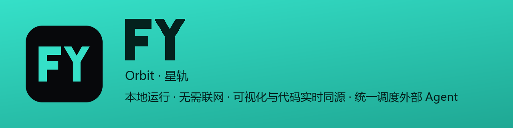
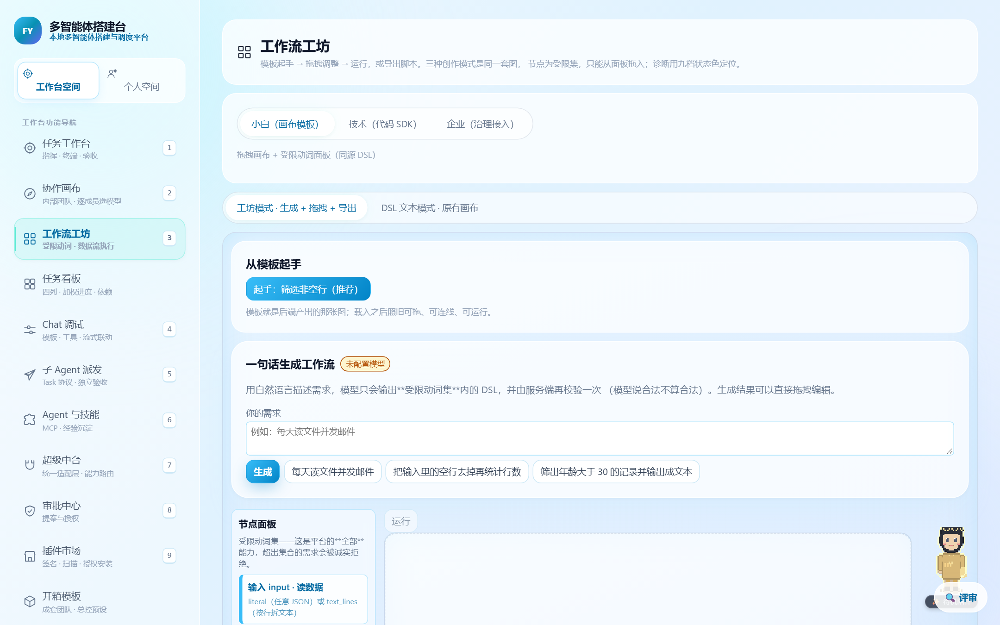
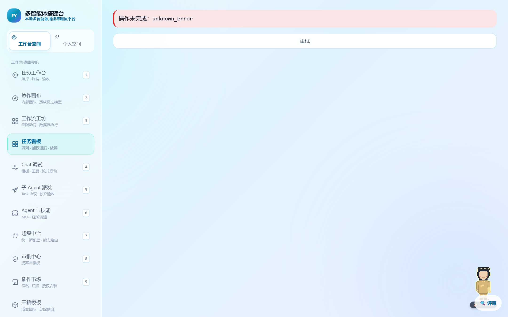
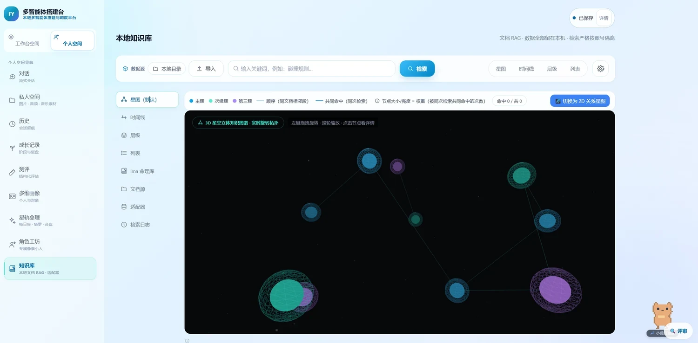
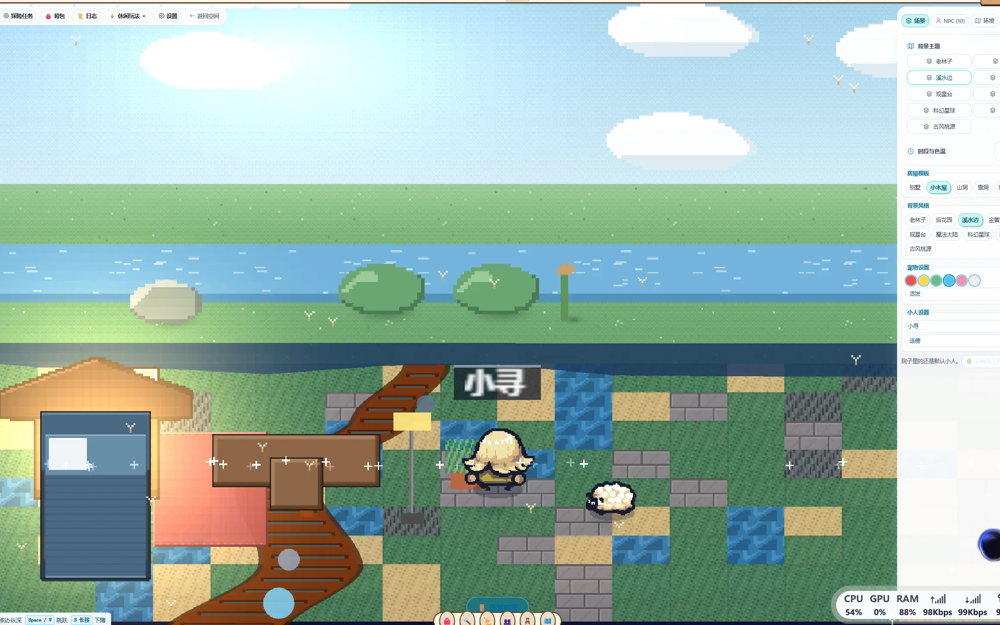

<p align="center">
  
</p>

<h1 align="center">FY Orbit · 星轨 (Find Yourself)</h1>

<p align="center">
  <strong>本地优先的多智能体编排与统一调度中台</strong><br>
  <em>Local-First Multi-Agent Orchestration &amp; Unified Scheduling Workbench</em>
</p>

<p align="center">
  <a href="https://github.com/intp41455/FY-Orbit/releases/download/v1.0.0/FY-Orbit-Windows-v1.0.0.zip">
    
  </a>
  
  
  
  
  
  
  
  
</p>

---

## 📖 导航

[快速开始](#安装与开箱使用) · [核心定位](#-核心定位) · [工作台核心能力](#-工作台核心能力) · [统一调度](#2-多智能体统一调度) · [隐私与离线](#-隐私与离线) · [个人空间](#-第二特点--个人空间)

---

## 🎯 核心定位

**FY Orbit · 星轨** 是一个本地优先的多智能体编排与统一调度中台。

它把「搭建工作流」「调度智能体」「人在回路审批」「工程开发」四件事放进同一个工作台，
让编排逻辑与真实执行轨迹可见、可控、可回溯。

### 为什么做成这样

现成的多智能体工具大多在两端各留缺口：一端绑定公网 SaaS 或容器集群，数据必须上传、断网即停；
另一端只给代码库或终端，缺可视化、缺状态持久化，报错即中断。

星轨的选择是**把运行环境交回用户**：单机可跑、断网自洽、数据留在本地，
同时把工程开发所需的编辑器、终端、Git 与验收集成进同一个界面，不用来回切换工具。

### 三个核心支点

1. **统一调度**：自建 Agent 与外部成品 Agent 走同一套注册、路由、权限与状态同步通道；
   Agent 之间的消息传递走统一事件总线，任务派发与结果回收有据可查。
2. **人机共控**：高危写操作、敏感外部 API 与环境变更在执行前挂起等待人工裁决；
   高危操作前置落盘快照，可分叉、可精准回滚。
3. **状态不丢**：执行状态、会话快照与中间产物流式落盘到 SQLite，
   系统重启或网络恢复后扫描未决断点原位续作。

---

## ✨ 工作台核心能力

### 1. 工作流画布（画布 × 代码同源）
从微观工具链到宏观多智能体编排，支持任意复杂图拓扑与循环逻辑：
* **核心推理**：`llm` 大模型推理、`rag_query` 双路混合召回、`condition` 分支判定、`loop` 迭代批处理。
* **开发扩展**：`code` 内存受限脚本沙箱、`tool` 外部工具调用、`api_call` RESTful 请求、`subgraph` 模块化子图嵌套。
* **高并发协作**：`parallel` 并行派发、`join` 结果聚合器、`delay` 时序控制、`event_emit` / `event_listen` 异步事件总线。
* **状态与把关**：`variable_assign` 运行时变量管理、`data_transform` 结构转换、`human_review` 人在回路（HITL）审批。

<p align="center">
  
</p>

### 2. 多智能体统一调度

这是星轨的主线能力：把分散的 Agent 收进一套调度体系里。

* **跨来源统一纳管**：自建 Agent 与外部成品 Agent 走同一套注册、路由、权限与状态同步通道，不按来源分裂成两套体系。
* **实时消息传递**：Agent 之间的消息与状态回写走统一事件总线，任务派发与结果回收有据可查。
* **任务分配与认领**：支持任务指派、抢占式认领与前置依赖约束，调度过程可观察。
* **能力对标**：在编排灵活性、状态持久化与工程工具链三个维度上对标主流图编排与编码 Agent 框架的能力边界。

### 3. 三重模式同源切换
同一套工作流逻辑在三种形态间无损切换：
* **🌱 向导模式**：自然语言输入目标，自动拆解并组装工作流骨架。
* **⚡ 视觉画布模式 (Visual Canvas)**：基于高自由度平移缩放画布，多色端口类型防错吸附，直观拖拽编排。
* **🛠️ 工程向，支持 DSL、AST 语法树实时双向热同步与终端沙箱调试。

<p align="center">
  
</p>

### 4. 抗打断与断点续作
* **暂存必须落库**：执行状态、会话快照与中间产物全量流式落盘至 SQLite，杜绝仅驻留内存。
* **断网/重启秒级续作**：系统重启或网络恢复后，自动扫描未决断点并无缝原位接力开工。
* **事务外发箱 (`Outbox`)**：先占位、再执行、后确认，杜绝外部 API 误发与重复扣费。

### 5. 规划看板与排期视图
* **四状态任务流转**：待办、进行中、阻塞与完成状态机，支持前置依赖与抢占认领。
* **原生 SVG 甘特规划图 (`GanttChart`)**：直观呈现任务排期重叠、时序依赖与里程碑节点。
* **动态燃尽与燃起图 (`BurndownChart`)**：真实执行轨迹与理想工期斜率对比，量化项目健康度。

<p align="center">
  
</p>

### 6. 工程工具链内嵌

代码区、终端沙箱、Git 提交图谱与差异对比、预览与验收集成在同一工作台内，
编排与执行不必在多个工具之间切换。

---

## 🌌 第二特点 · 个人空间

除了工作台与多智能体基座，星轨还内置了一套个人空间，用于承载与工程业务无关的长期个人资产：

### 1. 端侧双轨 RAG 与 3D 知识星图
* **零外部服务依赖**：内置轻量高效的哈希特征向量与 `sqlite-vec` 向量数据库扩展。
* **双路精准融合召回**：SQLite FTS5 (BM25 词法全文检索) + 向量语义搜索，通过 RRF 算法智能重排。
* **Three.js 3D 知识星图**：将本地知识库渲染为三维星系旋臂与引力连线，支持空间漫游与聚焦抽屉。

<p align="center">
  
</p>

### 2. 数码小屋与桌宠
* **数码小屋**：像素场景自留地，支持家具布置与晨昏昼夜光影变幻，家具改动可持久化保存。
* **桌面伴读桌宠**：具备动态状态反馈与伴读互动。
* **闲暇小项目**：内嵌数款极简减压互动，在长流程调试间歇放松一下。

<p align="center">
  
</p>

### 3. 确定性排盘与画像
* **纯算法本地推算**：四柱生辰八字（干支、藏干、十神、纳音、旺相休囚死）确定性推算。
* **现代占星与每日运势**：紫微斗数、星盘相位、每日签卡与塔罗抽牌正逆位深度解析（内置严谨合规免责声明）。

---

## 🚀 安装与开箱使用

### 方式一：绿色免安装独立发行包（推荐）

1. 直接点击从 GitHub Release 下载官方 Windows 绿色独立安装包：  
   👉 **[下载 FY-Orbit-Windows-v1.0.0.zip ](https://github.com/intp41455/FY-Orbit/releases/download/v1.0.0/FY-Orbit-Windows-v1.0.0.zip)**
2. 解压到任意文件夹；
3. 双击运行 `FY-Orbit.bat`（或 `start.bat`），系统将自动拉起服务并以独立原生应用窗口启动工作台，零配置开箱即跑！

### 方式二：项目主页

**[FY Orbit 官方主页](https://fy-orbit.pages.dev/)**

工作台需在本机启动后访问 `http://127.0.0.1:8000/workbench`。

### 方式三：从源码运行

```bash
# 1. 准备 Python 3.11+ 虚拟环境
python -m venv .venv
source .venv/bin/activate  # Windows: .venv\Scripts\activate

# 2. 安装并启动
pip install -e .
python run.py --port 8000
```

---

## 📖 核心服务端点与接口文档

服务启动后，可在浏览器直接访问以下核心端点：

| 访问地址 | 对应功能与说明 |
| :--- | :--- |
| `http://127.0.0.1:8000/` | Web 主工作台、画布工作流与系统首页 |
| `http://127.0.0.1:8000/landing.html` | 官方深色质感宣传落地页 |
| `http://127.0.0.1:8000/docs` | OpenAPI / Swagger 交互式接口文档（**426 个接口路径 / 486 个接口操作**，本地实测） |
| `http://127.0.0.1:8000/redoc` | ReDoc 规格说明文档 |

---

## 🔒 隐私与离线

1. **默认离线运作（Default-Offline）**：系统默认处于 `FY_OFFLINE_MODE=True`，未经用户明确授权，绝不静默向任何公网外传数据。
2. **数据资产主权**：所有工作流配置、本地向量索引、文档知识库与中间过程状态均保存在本地磁盘，彻底隔绝外部嗅探。
3. **审计链**：关键配置变更与越权拦截实时计入 SHA-256 审计哈希链，可导出核验。

---

## 📖 开源许可证

本项目基于 [Apache License 2.0](LICENSE) 协议开源。

