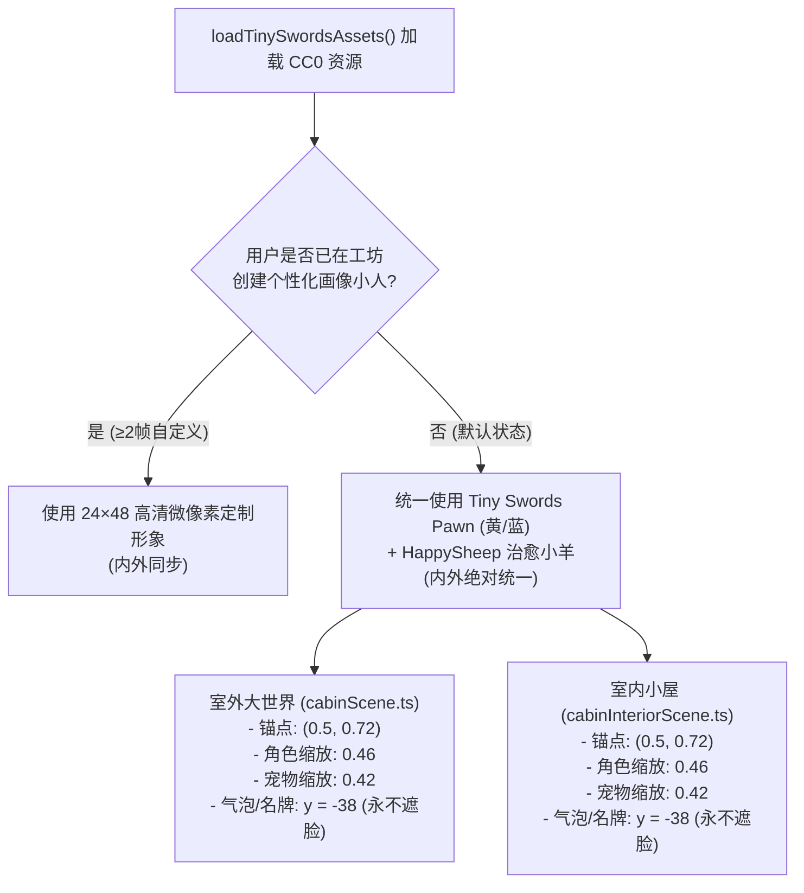

# 🎮 数码小屋与工作台桌宠伴侣 · 完整游戏资料包与开发维护全景指南
> **Game Studio Assets & Development Kit (Unified Handoff Dossier)**  
> **文档版本**：v2.0 (全量统一版)  
> **分支**：`feat/cabin-game-deskpet`  
> **适用对象**：后续接手此项目的 Agent、游戏策划、前端开发与美术工程师。

---

## 目录
1. [项目定位与核心架构](#一项目定位与核心架构)
2. [59 个游戏工业级 Skills 清单与绝对路径](#二59-个游戏工业级-skills-清单与绝对路径)
3. [游戏素材来源开源协议与切片规范](#三游戏素材来源开源协议与切片规范)
4. [核心代码资产与架构地图](#四核心代码资产与架构地图)
5. [室内外角色与宠物统一渲染规范](#五室内外角色与宠物统一渲染规范)
6. [后续 Agent 极速接手与周期性更新维护 SOP](#六后续-agent-极速接手与周期性更新维护-sop)

---

## 一、项目定位与核心架构

数码小屋是一个深度嵌入于智能体工作台的 **2.5D 治愈系像素经营探索游戏**，与智能体平台的多维画像体系（MBTI 16 型人格、八字五行、实时心境）双向联通：
1. **大世界探索（室外）**：打破横线切割，具备 2.5D 双轴平滑摄像机、蜿蜒延伸山道、近大远小景深探索、WASD 键盘控制、抛物线跳跃与长按 S 下蹲 Squash & Stretch。
2. **温馨木屋（室内）**：全视口原木温馨木屋，支持 28 种家具自由布置，晨光梯形光斑漫射，消除四周黑边。
3. **全局工作台桌宠（Desk Pet）**：在非小屋页面常驻陪伴，根据画像生成个性化台词，支持抚摸、戳戳、一键进屋，路由自动切换。

### 技术栈
- **图形渲染**：Pixi.js v8.3.1 (像素风关闭抗锯齿 `roundPixels: true`, Nearest 采样)
- **UI 框架**：React 18 + TypeScript + Vite 8
- **测试框架**：Vitest 3.2.4 (1105 项单测 100% 绿灯)
- **实机抓拍**：Playwright (Chromium 无头自动化验证)

---

## 二、59 个游戏工业级 Skills 清单与绝对路径

机器上已安装完备的游戏开发技能库，涵盖策划、美术、工程手感、关卡与系统架构：

### 1. 全局插件库 (Global Game Studio Kit)
- **插件清单路径**：`C:/Users/intpj/.gemini/config/plugins/game-studio-kit/plugin.json`
- **工业标准准则**：`C:/Users/intpj/.gemini/config/plugins/game-studio-kit/rules/AGENTS.md`（包含“先找乐子”、美术风格圣经、工程手感 Juice 规范）

### 2. 工作区专属技能目录 (Workspace Skills)
- **技能根路径**：`c:/Users/intpj/Documents/Codex/2026-09-29/.agents/skills/`

### 3. 核心游戏技能分类与绝对路径速查表

| 领域 | 技能名称 | 绝对路径 | 项目中负责的具体模块 |
| :--- | :--- | :--- | :--- |
| **镜头与视口** | `camera-systems` | `c:/Users/intpj/Documents/Codex/2026-09-29/.agents/skills/camera-systems/SKILL.md` | 2.5D 双轴平滑跟踪摄像机、视差滚动、景深微透视 (`cabinConfig.ts`) |
| **操作与控制** | `input-systems` | `C:/Users/intpj/.gemini/config/plugins/game-studio-kit/skills/input-systems/SKILL.md` | WASD / 方向键映射、按键缓冲 (150ms)、输入框防误触 (`cabinInput.ts`) |
| **手感与动力学** | `game-feel` | `C:/Users/intpj/.gemini/config/plugins/game-studio-kit/skills/game-feel/SKILL.md` | 抛物线跳跃、空中滞空微动、落地挤压回弹、下蹲变形 (`cabinScene.ts`) |
| **角色设计** | `character-design` | `c:/Users/intpj/Documents/Codex/2026-09-29/.agents/skills/character-design/SKILL.md` | 模块化微像素角色部件库 (64,000+ 组合)、Tiny Swords 角色适配 |
| **环境与地貌** | `environment-art` | `c:/Users/intpj/Documents/Codex/2026-09-29/.agents/skills/environment-art/SKILL.md` | 5 大场景蜿蜒山道生成、自然植被、全屏地表瓦片 (`cabinWindingPaths.ts`) |
| **叙事与对话** | `dialogue-systems` | `C:/Users/intpj/.gemini/config/plugins/game-studio-kit/skills/dialogue-systems/SKILL.md` | NPC 台词气泡、头顶上浮防挡脸、MBTI/五行性格对话生成器 |
| **物理调优** | `physics-tuning` | `C:/Users/intpj/.gemini/config/plugins/game-studio-kit/skills/physics-tuning/SKILL.md` | 重力加速度、跳跃初速度、阻尼插值 (`cabinScene.ts`) |
| **关卡与空间** | `level-design` | `C:/Users/intpj/.gemini/config/plugins/game-studio-kit/skills/level-design/SKILL.md` | 大世界地块网格 (160×100)、室内空间网格对齐与家具碰撞 |
| **像素美术生成** | `pixel-art-sprites` | `C:/Users/intpj/.gemini/config/plugins/game-studio-kit/skills/pixel-art-sprites/SKILL.md` | 28 种家具手绘矩阵、壁炉高精雕花、微像素小人呼吸动画 |
| **AI 行为与状态机**| `game-ai-behavior-trees` | `C:/Users/intpj/.gemini/config/plugins/game-studio-kit/skills/game-ai-behavior-trees/SKILL.md` | 桌面宠物伴侣自由漫步、小憩打瞌睡、伸懒腰状态机 (`DeskPetCompanion.tsx`) |
| **核心循环设计** | `game-design-core-loop-extractor` | `C:/Users/intpj/.gemini/config/plugins/game-studio-kit/skills/game-design-core-loop-extractor/SKILL.md` | 30 秒“探索-收获-布置-互动”核心循环 |
| **保存系统** | `save-systems` | `C:/Users/intpj/.gemini/config/plugins/game-studio-kit/skills/save-systems/SKILL.md` | 室内布局本地 localStorage 缓存与后端 REST 乐观锁双写 |

*(注：其余技能如 `combat-design`, `game-audio`, `lighting-design`, `progression-systems` 等均位于上述技能根目录下，随时可由后续 Agent 按需直接载入)*

---

## 三、游戏素材来源、开源协议与切片规范

本项目所有使用的美术素材均为 **100% 商业友好开源码包 (CC0 1.0 Universal / Public Domain)** 或由代码程序化生成的矢量像素矩阵，没有任何版权或授权风险。

### 1. Tiny Swords (Pixel Frog) - 核心高精微像素手绘包
- **协议**：CC0 1.0 Universal (Public Domain)
- **本地存储路径**：`web/public/assets/packs/tiny_swords/`
- **许可文件**：`web/public/assets/packs/tiny_swords/LICENSE.txt`
- **核心切片规则表**：

| 资产类别 | 本地相对路径 | 原始切片网格 | 帧数与行布局 | 渲染锚点 (Anchor) | 游戏内基准缩放 |
| :--- | :--- | :--- | :--- | :--- | :--- |
| **主角小人 (黄)** | `Characters/Pawn_Yellow.png` | 192×192 px | Row 0: 待机 6 帧<br/>Row 1: 行走 6 帧 | `(0.5, 0.72)` | `0.46` |
| **主角小人 (蓝)** | `Characters/Pawn_Blue.png` | 192×192 px | 同上 | `(0.5, 0.72)` | `0.46` |
| **治愈小羊 (萌宠)**| `Sheep/HappySheep_Idle.png` | 128×128 px | Row 0: 待机/咀嚼 8 帧 | `(0.5, 0.68)` | `0.42` |
| **房屋建筑 (黄)** | `Houses/House_Yellow.png` | 128×192 px | 静态单张 | `(0.5, 1.0)` | 自适应对齐 |
| **房屋建筑 (蓝)** | `Houses/House_Blue.png` | 128×192 px | 静态单张 | `(0.5, 1.0)` | 自适应对齐 |
| **自然大树** | `Trees/Tree.png` | 192×192 px | 静态多层 | `(0.5, 0.85)` | `0.85` |
| **平坦地形瓦片** | `Terrain/Tilemap_Flat.png` | 64×64 px 瓦片组 | 自动平铺地面 | - | 自适应平铺 |
| **环境装饰 01-17** | `Deco/01.png` ~ `17.png` | 64×64 px | 灌木、野花、蘑菇、木栅栏、路标 | - | `0.5 ~ 0.8` |

### 2. Kenney Tiny Town (Kenney.nl)
- **协议**：CC0 1.0 Universal (Public Domain)
- **本地存储路径**：`web/public/assets/packs/kenney_tiny_town/`
- **说明**：包含 131 块 16×16 微像素小镇、砖墙、路面瓦片，用于庭院与小道辅助拼接。

### 3. 程序化高精手绘像素矩阵库 (Procedural In-Code Assets)
由工程代码通过 `PixelBuffer` 直接渲染出的像素资产，全部支持零 HTTP 请求即时着色：
- **28 款室内家具**：`web/src/components/cabin/interior/furnitureArt.ts`
  - 重点：26×26 高精铸铁石砌壁炉、复古大衣柜、双人原木床、留声机、水族鱼缸、绿植盆栽。
- **5 大场景蜿蜒深径**：`web/src/components/cabin/cabinWindingPaths.ts`
  - 青苔密林深径、白玉鹅卵石园径、金麦田埂车辙、垂钓木栈桥与汀步石、星纹汉白玉台阶。
- **昼夜色温系统**：`TIME_OF_DAY_LIST`（早晨微金 2000K、正午清澈、黄昏暖橙、深夜紫蓝）。

---

## 四、核心代码资产与架构地图

```
web/
├── public/assets/packs/          # CC0 游戏美术资产包 (Tiny Swords & Kenney)
│   ├── tiny_swords/              # 角色、小羊、房屋、树木切片
│   └── kenney_tiny_town/         # 瓦片底图
├── src/
│   ├── components/
│   │   ├── cabin/                # 🏡 小屋游戏核心引擎
│   │   │   ├── cabinScene.ts     # 室外大世界 PixiJS 场景主循环 (键盘/跳跃/双轴相机/角色)
│   │   │   ├── CabinStage.tsx    # 室外 React 挂载薄壳与操作指南 HUD
│   │   │   ├── cabinTinySwordsArt.ts # Tiny Swords 资产加载器与切片裁剪管线
│   │   │   ├── cabinInput.ts     # 键盘 WASD / 方向键 / 空格 / 下蹲系统
│   │   │   ├── cabinWindingPaths.ts  # 5 大场景向纵深延伸的蜿蜒小径生成器
│   │   │   ├── cabinModularAvatar.ts # 6.4万+ 种自由换皮与 AI 画像角色生成器
│   │   │   ├── cabinNpcSystem.ts # 5 大场景专属 NPC 名册、立绘、台词与赠礼系统
│   │   │   ├── cabinThemedWorlds.ts  # 场景特征与交互植物（采摘/收获）
│   │   │   ├── cabinConfig.ts    # 物理参数、双轴镜头算子、微透视景深公式
│   │   │   └── interior/         # 🛋️ 室内小屋场景
│   │   │       ├── cabinInteriorScene.ts # 室内主场景 (无黑边/晨光光斑/Pawn&羊同步)
│   │   │       ├── InteriorStage.tsx     # 室内 React 挂载薄壳
│   │   │       └── furnitureArt.ts       # 28 款高精家具手绘像素矩阵
│   │   ├── pet/                  # 🐾 全局工作台桌面宠物伴侣
│   │   │   ├── DeskPetCompanion.tsx # 常驻桌宠组件 (漫步/打瞌睡/气泡/进屋)
│   │   │   └── deskPetCompanion.css # 磨砂玻璃拟态动效样式
│   │   └── Layout.tsx            # 全局主框架，挂载 DeskPetCompanion
│   └── pages/
│       └── CabinPage.tsx         # 小屋主页面（室内外视图切换、抽屉选项卡）
└── capture_cabin.js              # Playwright 实机自动化全场景抓拍脚本
```

---

## 五、室内外角色与宠物统一渲染规范

**核心原则**：室外大世界与室内木屋必须保持 100% 视觉形象一致，坚决杜绝内外两种不同人设的情况！



### 1. 角色动画参数
- **待机动画 (Idle)**：`getPawnFrames().idle`（6 帧，帧速 160ms/帧）
- **行走动画 (Walk)**：`getPawnFrames().walk`（6 帧，帧速 120ms/帧）
- **朝向控制**：根据移动方向 `dx` 自动翻转 `person.scale.x = personDir * ...`

### 2. 宠物动画参数
- **待机/跟随动画**：`getSheepFrames()`（8 帧，帧速 180ms/帧，咀嚼与摇耳微动）
- **跳跃跟随**：随玩家行走产生微小弹性跳跃位移。

---

## 六、后续 Agent 极速接手与周期性更新维护 SOP

后续任何接手本项目的 Agent，请直接遵照以下标准步骤操作：

### 1. 运行与验证指令
- **启动前端服务**：
  ```bash
  npx vite --port 5178 --host 127.0.0.1
  ```
- **自动化类型检查 (TypeCheck)**：
  ```bash
  npm run typecheck
  ```
- **运行全量单测 (Vitest)**：
  ```bash
  npm test -- --run
  ```
- **一键自动化截图留证**：
  ```bash
  node capture_cabin.js
  ```

---

### 2. 常见迭代场景 Step-by-Step 操作指引

#### 场景 A：新增或更换角色服装 / 发型 / 皮肤
1. 打开 `web/src/components/cabin/cabinModularAvatar.ts`；
2. 在 `MODULAR_HAIRSTYLES` 或 `MODULAR_OUTFITS` 数组中追加新的部件定义与像素矩阵；
3. 部件命名规范：保持 `24×48` 规范，并在 `cabinModularAvatar.test.ts` 中补充组合测试用例；
4. 运行 `npm test -- --run` 确保绿灯。

#### 场景 B：新增一个探索地图或修改小道地貌
1. 打开 `web/src/components/cabin/cabinConfig.ts`，在 `CabinBackgroundId` 联合类型中增加地图 ID；
2. 打开 `web/src/components/cabin/cabinWindingPaths.ts`：
   - 在 `WINDING_PATH_CONFIGS` 中配置该地图的路径走向、控制点 `points`、路宽 `pathWidth`、材质颜色 `pathColor`；
3. 打开 `web/src/components/cabin/cabinThemedWorlds.ts`，配置专属交互植物与采摘产物；
4. 打开 `web/src/components/cabin/cabinNpcSystem.ts`，为新地图指派一位专属 NPC。

#### 场景 C：新增一位场景 NPC 或调整台词剧情
1. 打开 `web/src/components/cabin/cabinNpcSystem.ts`；
2. 在 `EXCLUSIVE_NPCS` 对象中增加该 NPC 的姓名、称号、背景故事、立绘色板、以及 `dialogues` 台词库；
3. 在 `giftPreferences` 中配置其喜爱的礼物等级（`love`, `like`, `neutral`, `dislike`）；
4. 运行 `npm test -- --run` 校验 NPC 系统的 14 项单测。

#### 场景 D：新增一件室内家具
1. 打开 `web/src/components/cabin/interior/furnitureArt.ts`；
2. 在 `FURNITURE_REGISTRY` 中注册家具 ID、分类、占地网格宽高 (`sizeCells: { w, h }`)、贴墙/贴地属性；
3. 在 `drawFurniture()` 中用 `PixelBuffer` 绘制家具的像素外形与倒角高光；
4. 运行 `npm test -- --run` 校验家具图层的 32 项单测。

#### 场景 E：调整键盘控制与手感参数
1. 打开 `web/src/components/cabin/cabinScene.ts`：
   - 起跳初速度：`JUMP_SPEED` (默认 185)
   - 空间重力加速度：`GRAVITY` (默认 520)
   - 下蹲变形比例：`crouchScaleY = 1 - (1 - 0.72) * crouchProgress`
   - 双轴摄像机插值速度：`lerpCameraY` (默认 `0.08`)
2. 打开 `web/src/components/cabin/cabinConfig.ts`：
   - 景深透视缩放范围：`depthPerspectiveScale(depth)` (默认 0.82 ~ 1.05)
